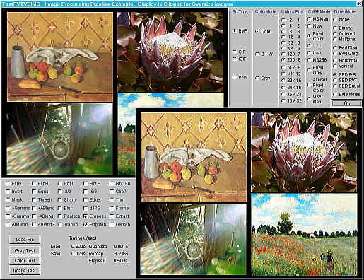



## RVTVBIMG  v2

### Description

Image Processing in VB. A complete rewrite of the 2001 version. Read all uncompressed BMPs, GIF, JPG and PNM files. Write BMP, GIF and PNM files. Also capture/return external Bitmaps and StdPics. Extended Color Depth/Palette options. Dithers enhanced. New Blue Noise Dither. More than 20 new operations - including alphablending and color combination, Sharpen, Blur, Edge, Equalization, and color correction. Particular support for very large BMPs >16M in size. The compiled .dll is many times quicker than in the IDE. Apps using previous (2001)version will require checking and recompilation.
 
### More Info
 
Knowledge of Image Processing techniques useful

             |
---                |---
**Submitted On**   |2003-08-05 23:05:44
**By**             |[Ron van Tilburg](https://github.com/Planet-Source-Code/PSCIndex/blob/master/ByAuthor/ron-van-tilburg.md)
**Level**          |Advanced
**User Rating**    |5.0 (55 globes from 11 users)
**Compatibility**  |VB 6\.0
**Category**       |[Graphics](https://github.com/Planet-Source-Code/PSCIndex/blob/master/ByCategory/graphics__1-46.md)
**World**          |[Visual Basic](https://github.com/Planet-Source-Code/PSCIndex/blob/master/ByWorld/visual-basic.md)
**Archive File**   |[RVTVBIMG\_\_162474862003\.zip](https://github.com/Planet-Source-Code/ron-van-tilburg-rvtvbimg-v2__1-47445/archive/master.zip)

### API Declarations

BitMap functions from GDI

